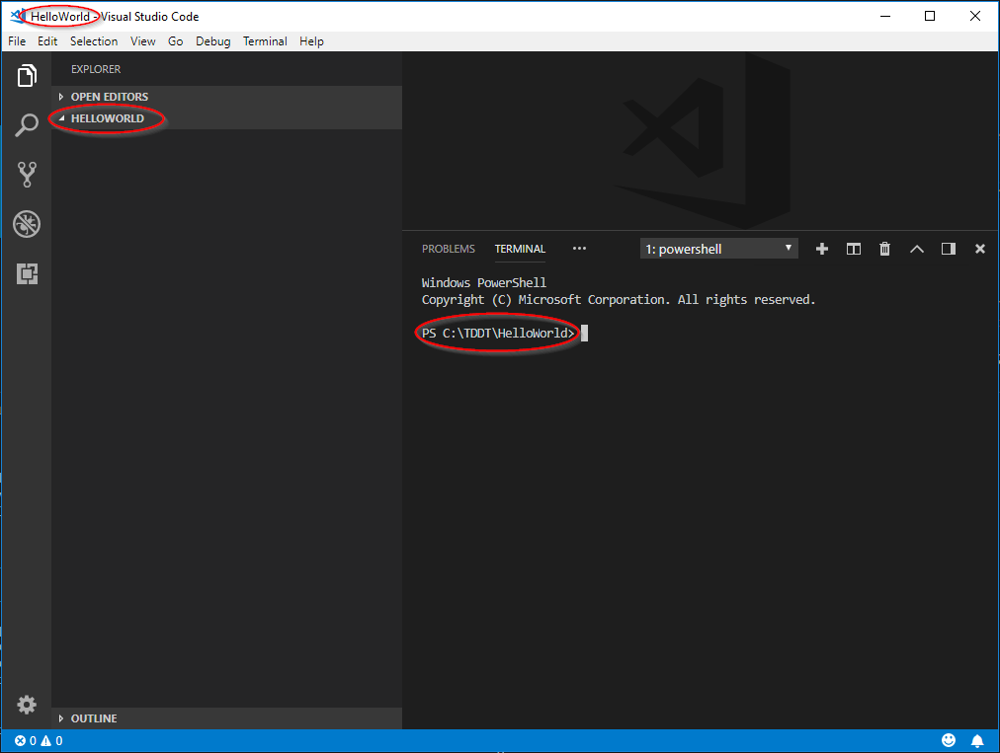

# TDDT
Test Driven Developer Training is an attempt to help somebody completely new to programming learn how to write well structured, fully test code from the start. 
There is plenty of courses online, even more 'hello world' examples. All you have to do is watch a video, or copy and paste a little bit of code and it just 'works'. In my experience they don't help much in terms of learning to code. There are so popular kata's that are great to keep your skills fresh, or even to learn some new techniques, or tricks, but they don't help at all in terms of deciding what one needs to learn to become a developer. 

So what is it that one has to learn to be able to program in 2018? There is a miriad of choices across multiple categories:
* The problem solving skills - algorythms, data structures and such
* The IDEs, repos and such - tools one uses to produce code
* The programming languages - one is typically not enough
* The standard frameworks and libraries - not to reinvent the wheel
* The theory and the acronyms - SOLID, CAP, ACID, TDD and such

# Workstation setup - the Tools

## 1. Git
Install [git](https://git-scm.com/about) from (https://git-scm.com/download/win). `Git` is a [source code repository](https://en.wikipedia.org/wiki/Version_control) which helps to manage code versions and collaborate with other developers. Althought it is not strictly required to write your first 'hello world' application, it will make the learning easier. As you save your progress regularily, if something goes wrong you will be able to go back to the last working version and start again from that point. Install using default settings. 

After installation you should be able to find `Git Bash` in your start menu. When started it looks like the command prompt.
Type in `git --version` followed by enter to see if git is installed. The result should be something like this:

```
$ git --version
git version 2.19.0.windows.1
```

## 2. .NET Core SDK 
Install [.NET Core SDK] from (https://www.microsoft.com/net/download?initial-os=windows). Click on `Download .NET Core SDK` and follow the instructions. [.NET Core](https://en.wikipedia.org/wiki/.NET_Core) is a [software framework](https://en.wikipedia.org/wiki/Software_framework) on which we will be building our software. [SDK](https://en.wikipedia.org/wiki/Software_development_kit) stands for Software Development Kit and is a set of tools used to help development of software. After installing the .NET Core SDK among many other things you will have the `dotnet` command which we will use a lot to create projects, to build, test and run the applications we are about to write. 

Aftetr installation you should be able to open `Git Bash` again and type `dotnet --version` followed by enter. If everything went as expected you will see the current dotnet version. The output should be something like this:

```
$ dotnet --version
2.1.402
```

## 3. NUnit Templates
[NUnit](https://en.wikipedia.org/wiki/NUnit) is a [unit testing](https://en.wikipedia.org/wiki/Unit_testing) framework we will use to make sure the code we are about to write does exactly what it is supposed to do. Unit testing is a very important part of software development which is often overlooked, definately at the beginning, it is often claimed that it is difficult and takes too much time. That can be true, especially when tests are added after the code has been written without following necessary patterns and practicies but when one starts with a test, in a [TDD](https://en.wikipedia.org/wiki/Test-driven_development) fashion, it soon becomes a second nature and allows to write better code fast. 

Install NUnit templates by executing the following command in the Git Bash

```
dotnet new -i NUnit3.DotNetNew.Template
```

## 4. Visual Studio Code
Install [VS Code](https://en.wikipedia.org/wiki/Visual_Studio_Code) which is the source code editor we will use to start developing simple applications.
Follow the instructions on (https://code.visualstudio.com/) to download and install VS Code. 

After installation you will find `Visual Studio Code` in your start menu. 

## 5. Visual Studio Code Extensions
Although Visual Studio Code (VS Code) is useful on its own, it can use extensions which are developed and distributed independently. To make life easier through this lengthy hello world example install `C# (ms-vscode.csharp)` and `Gitlens (eamodio.gitlens)` extensions using the following commands: 

```
code --install-extension ms-vscode.csharp
code --install-extension eamodio.gitlens
```

The C# extension will help you with [syntax highlighting](https://en.wikipedia.org/wiki/Syntax_highlighting) and [intellisense](https://en.wikipedia.org/wiki/Intelligent_code_completion) while Gitlens will help to use git repository. 

## 6. Getting to know VS Code 
From now on most of the work you will do in VS Code so it is worth learning more about it. There is a good introductory [video](https://code.visualstudio.com/docs/introvideos/basics) on the official project website. There you will learn about the basic features but also where to find more information. VS Code will be your main tool for writing code for a while, so it is worth learning it well, but not necessarily all up-front. 

# Hello World

It is a long standing tradition to start learning of a new programming langauge with a `Hello World` application. The objectie is to write an application that will display a 'Hello World' message to the user. With modern tools like Visual Studio (not Code) it is possible to write such application with exactly 3 mouse clicks and no typing at all. But this doesn't teach much, it shows how to generate code that does something trivial without explaining why and how things work. It doesn't explain how to test a code either, a skill which is as important as coding itself. We will do it differently. It will take much longer, that's for sure, but hopefully it will allow you to understand what is happening, a good start to learning to write computer programs. To make most of the learning process don't be lazy, don't copy and past but instead type all the commands and code yourself. If you find any errors, try to solve the problem or ask for help online. 

## 1. Create a folder for the solution
Now that all the tools are ready we need to have a folder where the code will be written. 
Create a folder `C:\TDDT\HelloWorld` 

## 2. Initialize the repository

Open the `C:\TDDT\HelloWorld` folder in Code. You can find it in the start menu and then choose 'Open Folder' option. You can press `[Ctrl+K]``[Ctrl+O]` when in Code too. My favourite option is to type `code C:\TDDT\HelloWorld` in the command prompt.

Once the folder has been opened, close the welcome message and press `[Ctrl+']` to toggle the terminal. Your Code should look more or less like so:


From now on you can type the commands directly in VSCode, in the terminal instead of Git Bash, but Git Bash will still work. 

Next step is to create a git repository in the folder to let git know that we want it to version contents of that folder. To do so, make sure you are in the `C:\TDDT\HellowWorld` folder (the terminal prompt should be `PS C:\TDDT\HelloWorld>`). If you are not navigate to it by executing `cd C:\TDDT\HelloWorld` in the terminal. 

Now initiate the repository using 

```
git init
```

and check if it worked using 

```
git status
```

## 3. Create solution and projects

Next we will need to create a solution for the projects. Solution is a logical grouping of projects defined in a *.sln file and a project is a collection of files with code and other assets that get compiled into an executable or a library. It is an important part of the initial setup as we will be developing multiple projects at the same time. The easiest way to do so is using `dotnet` command. 

Navigate to C:\Dev\TDDT in the terminal and execute

```
dotnet new sln
```

which creates HelloWorld.sln file, which is now visible in VS Code Explorer
[HelloWorld.sln](C:\Dev\TDDT\Images\HelloWorld.SolutionFile.png)
The 1 in the blue cricle on top of Source Control icon indicates that there are uncommitted changes in the git repo. Let's ignore it for now and carry on creating the projects. 

```
dotnet new nunit -n HelloWorld.Tests
```

```
dotnet new classlib -n HelloWorld
dotnet add HelloWorld.Tests reference HelloWorld
dotnet sln add HelloWorld
dotnet sln add HelloWorld.Tests
```

# Practice Makes Perfect 

Hopefully you managed to follow the instructions to the end and now you have a fully tested Hello World application. That means you understand more than at the beginning as to what it takes to write a set of instructions for a computer to perform a simple action and how to do it well. But could you do it on your own yet? Probably not, and if that is the case I suggest rather than trying to do something more complex now, you go back and start this Hello World application again. Can you remember the steps? Can you remember the commands? Can you remember the code? Do it again and again, until you can do 80% without looking at the instructions. 