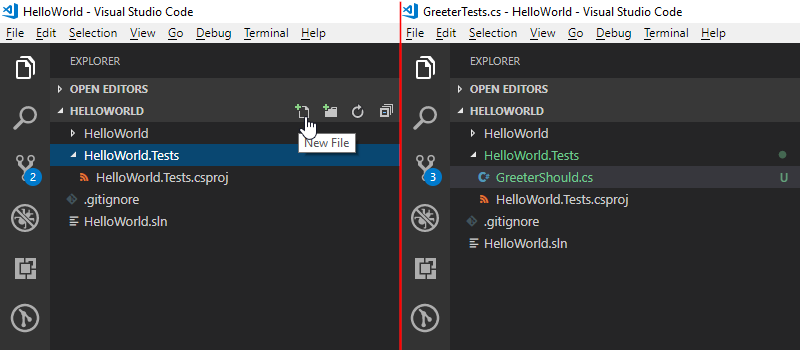
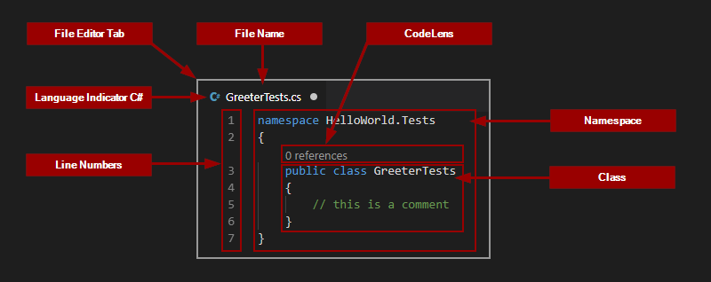

# Hello World

It is a long standing tradition to start learning of a new programming langauge with a `Hello World` application. The objective is to write an application that will display a 'Hello World' message to the user. With modern tools like Visual Studio (not Code) it is possible to write such application with exactly 3 mouse clicks and no typing at all. But this doesn't teach much, it shows how to generate code that does something trivial without explaining why and how things work. It doesn't explain how to test a code either, a skill which is as important as coding itself. We will do it differently. It will take much longer, that's for sure, but hopefully it will allow you to understand what is happening, a good start to learning to write computer programs. To make most of the learning process don't be lazy, don't copy and past but instead type all the commands and code yourself. If you find any errors, try to solve the problem or ask for help online. 

# Solution setup

## 1. Create a folder for the solution
Now that all the tools are ready we need to have a folder where the code will be written. 
Create a folder `C:\TDDT\HelloWorld` 
(Of course you can choose any name and any location you want, but for the sake of simplicity I will assume you'll go along with the suggested folder name for now)

## 2. Initialize the repository

Open the `C:\TDDT\HelloWorld` folder in Code. You can find it in the start menu and then choose 'Open Folder' option. You can press `[Ctrl+K]`+`[Ctrl+O]` when in Code too. My favourite option is to type `code C:\TDDT\HelloWorld` in the command prompt.

Once the folder has been opened, close the welcome message and press `[Ctrl+']` to toggle the terminal. Another way to open the terminal is to `Menu > View > Terminal`. Your Code should look more or less like so:


From now on you can type the commands directly in VSCode, in the terminal instead of Git Bash, but Git Bash will still work. 

Next step is to create a git repository in the folder to let git know that we want it to version contents of that folder. To do so, make sure you are in the `C:\TDDT\HellowWorld` folder (the terminal prompt should be `PS C:\TDDT\HelloWorld>`). If you are not navigate to it by executing `cd C:\TDDT\HelloWorld` in the terminal. 

Now initiate the repository.

__Command:__ 
```powershell
git init
```

__Expected Output:__
> PS C:\TDDT\HelloWorld> git init  
> Initialized empty Git repository in C:/TDDT/HelloWorld/.git/

Check if it really worked just to practice git commands.

__Command:__
```powershell
git status
```

__Expected Output:__
> PS C:\TDDT\HelloWorld> git status  
> On branch master  
> 
> No commits yet
>  
>nothing to commit (create/copy files and use "git add" to track)

It is worth reading more about git, but at the moment we will only the basics which will be explained here as they become necessary. 


## 3. Create solution and projects

Next we will need to create a solution for the projects. Solution is a logical grouping of projects defined in a *.sln file and a project is a collection of files with code and other assets that get compiled into an executable or a library. It is an important part of the initial setup as we will be developing multiple projects at the same time. The easiest way to do so is using `dotnet` command. 

<!-- TODO: explain why a folder, and that it needs to be created -->
Navigate to C:\TDDT in the terminal and execute

__Command:__
```powershell
dotnet new sln
```
__Expected Output:__
> PS C:\TDDT\HelloWorld> dotnet new sln  
> The template "Solution File" was created successfully.

__Command Explanation:__  
_The command invokes `dotnet` and tells it to create a `new` solution `sln` using the name of the current folder as a solution name. It is possible to specify another name using `-n` parameter._

`HelloWorld.sln` file is now visible in VS Code Explorer.


The number 1 in the blue cricle on top of Source Control icon indicates that there are uncommitted changes in the git repo. Let's ignore it for now and carry on creating the projects. As it is a TD (test driven approach we will start with a unit test project. It is where we will first write our tests to make sure the functionality we write is exactly as expected. Obviously it would be much faster to simply write the functionality and simply try it out, to see if the program works. But not every functionality we can write can be easily tested by an end user, and even if it is possible it takes time. At the beginning of a project it might seem like unit tests are waste of time, but as the time goes by and you keep modifying the code to add more and more features unit tests will save you a lot of time retesting and fixing stuff that used to work only the day before. 

There are many unit testing frameworks: mstest, nunit, xunit to name a few. For the purposes of this tutorial we will use NUnit. Create a unit test project.

__Command:__
```powershell
dotnet new nunit -n HelloWorld.Tests
```

__Expected Output:__  
>PS C:\TDDT\HelloWorld> dotnet new nunit -n HelloWorld.Tests  
>The template "NUnit 3 Test Project" was created successfully.  
>
>Processing post-creation actions...  
>Running 'dotnet restore' on HelloWorld.Tests\HelloWorld.Tests.csproj...  
> ⋮  
> Restore succeeded.

__Command Explanation:__  
_The above command invokes `dotnet` and tells it to create a `new` thing using the `nunit` template and naming `-n HelloWorld.Tests`._

Next we need a project in which we will implement the functionality. This will be a library project, which means it cannot be executed by itself, but it can define functionality which then can be used by other projects. 

__Command:__
```powershell
dotnet new classlib -n HelloWorld
```

__Expected Output:__
>PS C:\TDDT\HelloWorld> dotnet new classlib -n HelloWorld  
>The template "Class library" was created successfully.  
>
>Processing post-creation actions...  
>Running 'dotnet restore' on HelloWorld\HelloWorld.csproj...  
> ⋮  
>Restore succeeded.

__Command Explanation:__  
_The above command invoked `dotnet` and tells it to create a `new` thing using `classlib` template and naming it `-n HelloWorld`._

Becasue the test project `HelloWorld.Tests` is supposed to test our library `HelloWorld` it will have to be able to know about that library. In programing we call it references or dependencies. `HelloWorld.Tests` references (and depends on) `HelloWorld`.

__Command:__
```powershell
dotnet add HelloWorld.Tests reference HelloWorld
```

__Expected Output:__
>PS C:\TDDT\HelloWorld> dotnet add HelloWorld.Tests reference HelloWorld  
>Reference `..\HelloWorld\HelloWorld.csproj` added to the project.

__Command Explanation:__
_The above command invokes `dotnet` and tells it to add to `HelloWorld.Tests` a `reference` to `HelloWorld`._

The last thing left is to add both projects to the solution

__Commands:__
```powershell
dotnet sln add HelloWorld
dotnet sln add HelloWorld.Tests
```

__Expected Output:__
>PS C:\TDDT\HelloWorld> dotnet sln add HelloWorld  
>Project `HelloWorld\HelloWorld.csproj` added to the solution.  
>PS C:\TDDT\HelloWorld> dotnet sln add HelloWorld.Tests  
>Project `HelloWorld.Tests\HelloWorld.Tests.csproj` added to the solution.

__Command Explanation:__  
_The above command invoke `dotnet` and for solution (`sln`) in the local folder `add` a project `<project folder>`._

This is how the solution structure looks now, just before the first build


Building is a process of converting code and all of associated _assets_ into a computer understandable set of instructions. Building a solution is the first, most basic test if what we have written can be understood by the build process. If it failes we will not be able to execute our code. 

Build solution 

__Command:__
```powershell
dotnet build
```

__Expected Output:__
>
>Build succeeded.  
>&nbsp;&nbsp;&nbsp;0 Warning(s)  
>&nbsp;&nbsp;&nbsp;0 Error(s)  
>
>Time Elapsed 00:00:08.47

__Command Explanation:__  
_The above command invokes `dotnet` and tells it to build solution in the current folder._


There are many (in my case 21 but this can vary) changed files. Most of them autogenerated and in most case of no interest to a developer. They are there to allow the build tools to do their job (the obj folders) or an output of the build (the bin folders). There is no need to see those folder in the VS Code file explorer and in the case of the bin folder we shouldn't commit them either. The next step is to fix this. 

## 4. Add .gitignore file

Create the `.gitignore` file in the `C:\TDDT\HelloWorld` folder and add bin/ and obj/ to it. 

There are many ways to create this file. You can do `[Ctrl+N]` or you can go to menu and choose `File > New File` in VS Code. You can use the terminal there too. Then you will have to type in the two lines manually, or you can use the terminal again

__Command:__
```
'bin/','obj/' | Set-Content .gitignore
```

__Command Explanation:__  
The command taks two strings `bin/` and `obj/` and _pipes_ them to a file `.gitignore`. 

__`.gitignore` file:__
```
bin/
obj/
```

 This excludes `obj` and `bin` folders from being tracked by git.


## 5. Add VS Code settings

Fewer files are now tracked by git, but still in VS Code there are many files visible, which will only get in the way of day to day development. To hide them create `.vscode\settings.json` file with the following content

__`.vscode\settings.json` file:__
```
{ 
    "files.exclude": { 
        "**/bin/": true, 
        "**/obj/": true,
        ".vscode/": true
    }
}
```

The above is not a command but an example of the file's content. You will have to create the folder `.vscode` and the file `settings.json` in VS Code using the explorer panel or using the terminal.

__Commands:__
```powershell
New-Item .vscode -ItemType Directory
New-Item .vscode\settings.json
```

__Command Explanation:__
_The first command `New-Item` creates a new thing called `.vscode` and makes sure it is a directory (`-ItemType Directory`). The second one `New-Item` creates a new file `settings.json` in `.vscode`._

Alternatively in a single command 

__Command:__
```
New-Item .vscode\settings.json -Force
```

__Command Explanation:__  
_The command `New-Item` creates a new file at path `.vscode\settings.json` and the `-Force` switch ensures all the missing folders in the path are automatically created._

The `New-Item` command is a PowerShell command and it will not work in Git Bash so you have to execute it from the VS Code terminal or from another PowerShell window. 

The `.vscode\settings.json` is a collection of vs code's project specific settings that overwrite user and global settings. Specifically we are excluding files from the exclorer panel.


## 6. Stage and commit all the changes so far

Just before you do so make sure you can build the solution and that all the tests pass.

__Commands:__
```
dotnet build
dotnet test HelloWorld.Tests
```

__Expected Output:__
>PS C:\TDDT\HelloWorld>dotnet build  
> ⋮  
>Build succeeded.  
>&nbsp;&nbsp;&nbsp;0 Warning(s)  
>&nbsp;&nbsp;&nbsp;0 Error(s)  
>
>PS C:\TDDT\HelloWorld>dotnet test HelloWorld.Tests  
> ⋮  
>Starting test execution, please wait...  
>  
>Total tests: 1. Passed: 1. Failed: 0. Skipped: 0.  
>Test Run Successful.  
>Test execution time: 2.2111 Seconds  

Now, assuming no errors were returns, it is time to _save_ our changes. Of course the files are already saved on the disk, but they are not _saved_ in, or _committed_ to the repository. You still see them in the Source Control ([Ctrl+Shift+G]) panel. To save them you will have to first stage them. This seems unnecessary at first, but it allows you to commit a selection of files should you need to. For now either click the `+` icon next to each file (it will show when you hover over the file name in the Source Control panel) or click the `+` sign which appears when you hover over the _CHANGES_ in the Source Control panel. 

As with everything so far it is also possible to do this from terminal

__Commands:__
```
git status
git add .
git status
```

__Expected Output:__
>**PS C:\TDDT\HelloWorld> git status**  
>On branch master  
>
>No commits yet  
>
>Untracked files:  
>&nbsp;&nbsp;(use "git add <file>..." to include in what will be committed)
>
>&nbsp;&nbsp;&nbsp;&nbsp;&nbsp;&nbsp;.gitignore  
>&nbsp;&nbsp;&nbsp;&nbsp;&nbsp;&nbsp;.vscode/  
>&nbsp;&nbsp;&nbsp;&nbsp;&nbsp;&nbsp;HelloWorld.Tests/  
>&nbsp;&nbsp;&nbsp;&nbsp;&nbsp;&nbsp;HelloWorld.sln  
>&nbsp;&nbsp;&nbsp;&nbsp;&nbsp;&nbsp;HelloWorld/  
>
>nothing added to commit but untracked files present (use "git add" to track)
>
>**PS C:\TDDT\HelloWorld> git add .**  
>warning: LF will be replaced by CRLF in HelloWorld.Tests/UnitTest1.cs.  
>The file will have its original line endings in your working directory  
>
>**PS C:\TDDT\HelloWorld> git status**  
>On branch master  
>
>No commits yet  
>
>Changes to be committed:  
>&nbsp;&nbsp;&nbsp;(use "git rm --cached <file>..." to unstage)  
>  
>&nbsp;&nbsp;&nbsp;&nbsp;&nbsp;&nbsp;new file:   .gitignore  
>&nbsp;&nbsp;&nbsp;&nbsp;&nbsp;&nbsp;new file:   .vscode/settings.json  
>&nbsp;&nbsp;&nbsp;&nbsp;&nbsp;&nbsp;new file:   HelloWorld.Tests/HelloWorld.Tests.csproj  
>&nbsp;&nbsp;&nbsp;&nbsp;&nbsp;&nbsp;new file:   HelloWorld.Tests/UnitTest1.cs  
>&nbsp;&nbsp;&nbsp;&nbsp;&nbsp;&nbsp;new file:   HelloWorld.sln  
>&nbsp;&nbsp;&nbsp;&nbsp;&nbsp;&nbsp;new file:   HelloWorld/Class1.cs  
>&nbsp;&nbsp;&nbsp;&nbsp;&nbsp;&nbsp;new file:   HelloWorld/HelloWorld.csproj  

__Command Explanation:__  
_The first command `git status` is used to see which files have been modifed since the last commit and then they can be added using `git add <filename>` or as in the example above you can add all of them with `git add .`. Do `git status` again after adding, you will see that the files are now marked as staged (and they appear in green not in red)._


Now commit the staged changes. This will create a _checkpoint_ to which you will able to go back should you need to. This is important, we create commits so we can go through the history of changes. To make the history more useful each commit should have a short but meaningful commment explaining why the changs were made. Good commit messages explain the _reason_ not the _content_ of change. What has changed you can see in the commit itself. [Read more about good commit messages](https://medium.com/@andrewhowdencom/anatomy-of-a-good-commit-message-acd9c4490437). 

In VS Code type in `Setting up HelloWorld solution` in the Message textbox on the Source Control pannel and click the `tick` above it, or in Git Bash

__Command:__
```powershell
git commit -m"Setting up HelloWorld solution"
```

__Expected Output:__
>PS C:\TDDT\HelloWorld> git commit -m"Setting up HelloWorld solution"  
>[master (root-commit) 1434d0b] Setting up HelloWorld solution  
>&nbsp;&nbsp; 7 files changed, 102 insertions(+)  
>&nbsp;&nbsp; create mode 100644 .gitignore  
>&nbsp;&nbsp; create mode 100644 .vscode/settings.json  
>&nbsp;&nbsp; create mode 100644 HelloWorld.Tests/HelloWorld.Tests.csproj  
>&nbsp;&nbsp; create mode 100644 HelloWorld.Tests/UnitTest1.cs  
>&nbsp;&nbsp; create mode 100644 HelloWorld.sln  
>&nbsp;&nbsp; create mode 100644 HelloWorld/Class1.cs  
>&nbsp;&nbsp; create mode 100644 HelloWorld/HelloWorld.csproj  

__Command Explanation:__  
_The above command invokes `git` and tells it to `commit` with message `-m"<Message>"`_


Check nothing is left in the CHANGES in the Source Control pannel or that `git status` shows there are no changes, check out `git log` to see your commit and you are done with the solution setup.

# Unit tests

Test Driven Development is the idea that whatever functionality we want to code, first we should write a unit test which will check if that functionality is implemented correctly. Of course in the first step that functionality is not implemented, so the test will fail, that is OK, then we will implement the functionality and make the test pass. From now on everytime the code changes you can run that test and make sure new features are not breaking the older ones. The tests should be small to test one specific thing if only possible that way if one fails it will be easier to find what is wrong. 

In the earlier steps we have already created the test project `HelloWorld.Tests` and by default it created a first unit test file called `UnitTests1.cs`. It can be found in `HelloWorld\HelloWorld.Tests\UnitTests1.cs`. That file is the reason why when you run the tests the output says one test was successfu. 

>PS C:\TDDT\HelloWorld> dotnet test HelloWorld.Tests  
>Starting test execution, please wait...  
>  
>Total tests: 1. Passed: 1. Failed: 0. Skipped: 0.  
>Test Run Successful.

It contents of that file define an always passing test and it is helpful to write tests faster, but as it is a learning opportunity, let's delete that file and let's start _programming_ from scratch. 

## 7. Create Unit Tests File for the Greater Object

First, what is that Greeter Object? To explain that we need to start with exlaining [programming paradigms](https://en.wikipedia.org/wiki/Programming_paradigm) (it is easier than it sounds), and to explain that we need to understand what is [computer programming](https://en.wikipedia.org/wiki/Computer_programming). For me, at the most basic level, computer programming is solving problems with computers. To do that one has to define the problem and implement a solution using one or more programming languages which can then be compiled to computer understandable instructions and executed by the computer.

Programming languages are a bit like human langauges, they have words and grammar. They have been designed to help solve problems in a particular way. That particular way is the programming paradigm. It is important to understand because effectively that paradigm, specific way of solving problems is as important to understand as the language itself. There are imperative and declarative programming languages, most common nowadays are object oriented or functional. This hello World example attempts to show how to use [Object Oriented Programming](https://en.wikipedia.org/wiki/Object-oriented_programming) using [C#](https://en.wikipedia.org/wiki/C_Sharp_(programming_language)) to solve business problems in a way which is of professional quality. 

Object Oriented Programming or OOP is an attempt to model real world problems with _objects_ that model real world with structures containing data that describes their properties and methods that can modify that state, or more generally do some stuff. For example if you want to model a car, the _car_ would be the object, _speed_ would be a property and _accelerate_ a method that increases the _speed_.

Back to our first unit test. The first step is to create a file. Typically the filename is `<ObjectName>Tests.cs`. That means we need to decide what is our object. We want to write an application that says Hello World so in object oriented world we can imagine there is a person that greets us which we will model as a _greeter_ object. By convention in C# class names use _PascalCase_ and by default each _class_ (definition of an object) is defined in its own file with the same name. Also by convention a class testing another class has the same name but with _Tests_ appended to it. 

So what we know so far? 
We will need a `Greeter` object defined in `Greeter.cs` file in the `HelloWorld` project and to test it a `GreeterTests` object defined in `GreeterTests.cs` file in the `HelloWorld.Tests` project.

Create `GreaterTests.cs` file



Open the `GreeterTests.cs` file and define the namespace for our test class. Namespace could be called just about anything but by convention it should match the folder structure we put in place so in hour case `HelloWorld.Tests`.

__`GreeterTests.cs` file:__
```cs
namespace HelloWorld.Tests 
{

}
```

In the above code the `namespace` is the keyword that starts the definition of a new _namespace_. `HelloWorld.Tests` is the name of the _namespace_. The curly brackets `{` and `}` define the beginning and the end of the _namespace_. 

Now add the GreeterTests class definition in the namespace.

__`GreeterTests.cs` file:__
```cs 
namespace HelloWorld.Tests
{
    public class GreeterTests 
    {

    }
}
```

`public` is another keyword and an [access modifier](https://en.wikipedia.org/wiki/Access_modifiers). `class` is a keyword defining a class and `GreeterTests` is the name of the class. The curley brackets `{` and `}` once again define the beginning and the end of our definition. 

**Things to Remember**
* Namespaces group classes and help organise code. They also help avoiding naming conflicts. Each class name has to be unique, but only within a namespace. 
* Curly Brackets define scope, beginning and end of things in code.

If you look at the `GreeterTests.cs` file now in VS Code it will should look like so:



There are few things we haven't covered yet. There are line numbers which are displayed but are not part of the file (if you open the file in a notepad they will not be there). The line numbers help to navigate the code. Also, when there is a problem with the code the compilier will notify you quoting file name and line number. CodeLens if a feature of VS Code that helps you understand the code by giving you helpful, additional information like in this case that there are no references to the class, which means it can be changed without causing any problems. Not that it is not a new line, it's just a bit of information between lines 2 and 3. 

There is also a comment just to show that not everything in the code file is necessarily code. Anything that starts with `//` (in c#) is a comment and is ignored by the compiler. Things between `/*` and `*/` are also comments and are equally ignored. 