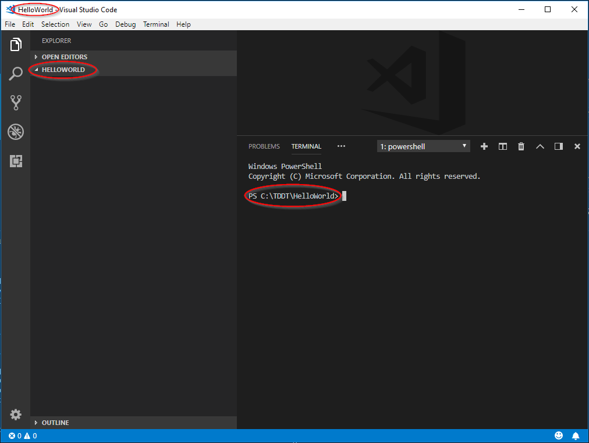
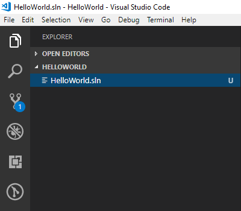
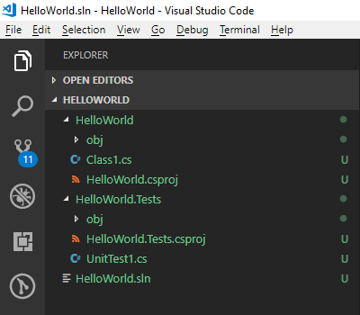
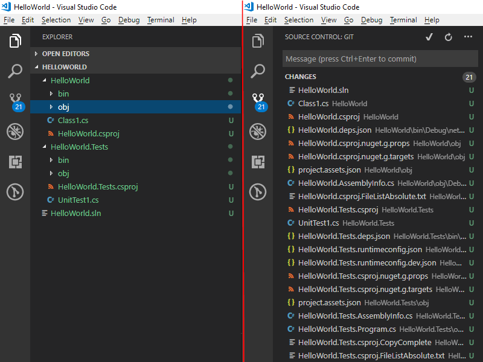
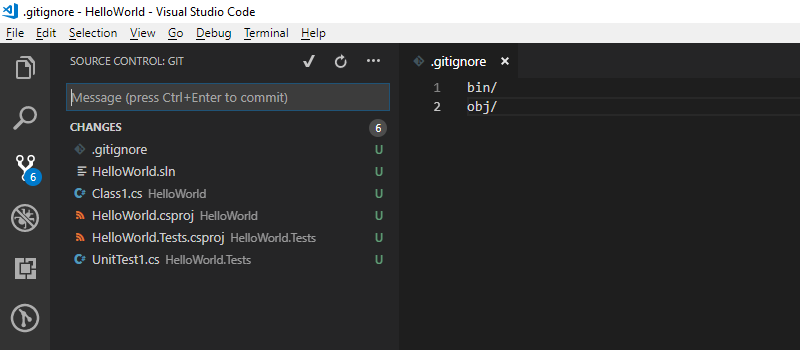
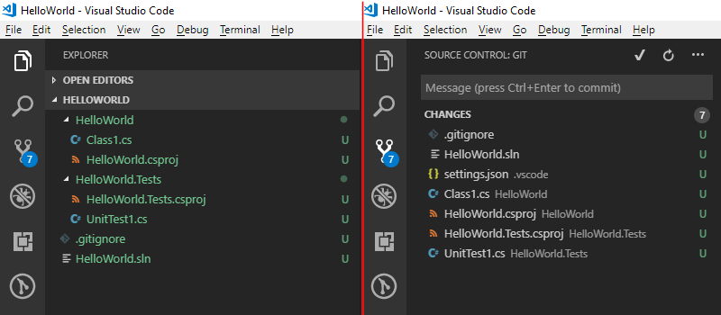
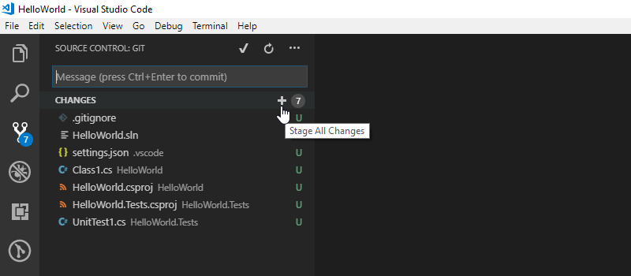
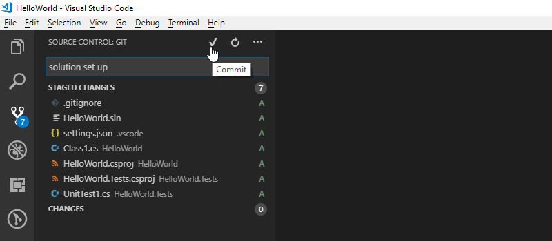

# Hello World

It is a long standing tradition to start learning of a new programming langauge with a `Hello World` application. The objective is to write an application that will display a 'Hello World' message to the user. With modern tools like Visual Studio (not Code) it is possible to write such application with exactly 3 mouse clicks and no typing at all. But this doesn't teach much, it shows how to generate code that does something trivial without explaining why and how things work. It doesn't explain how to test a code either, a skill which is as important as coding itself. We will do it differently. It will take much longer, that's for sure, but hopefully it will allow you to understand what is happening, a good start to learning to write computer programs. To make most of the learning process don't be lazy, don't copy and past but instead type all the commands and code yourself. If you find any errors, try to solve the problem or ask for help online. 

## 1. Create a folder for the solution
Now that all the tools are ready we need to have a folder where the code will be written. 
Create a folder `C:\TDDT\HelloWorld` 
(Of course you can choose any name and any location you want, but for the sake of simplicity I will assume you'll go along with the suggested folder name for now)

## 2. Initialize the repository

Open the `C:\TDDT\HelloWorld` folder in Code. You can find it in the start menu and then choose 'Open Folder' option. You can press `[Ctrl+K]`+`[Ctrl+O]` when in Code too. My favourite option is to type `code C:\TDDT\HelloWorld` in the command prompt.

Once the folder has been opened, close the welcome message and press `[Ctrl+']` to toggle the terminal. Another way to open the terminal is to `Menu > View > Terminal`. Your Code should look more or less like so:


From now on you can type the commands directly in VSCode, in the terminal instead of Git Bash, but Git Bash will still work. 

Next step is to create a git repository in the folder to let git know that we want it to version contents of that folder. To do so, make sure you are in the `C:\TDDT\HellowWorld` folder (the terminal prompt should be `PS C:\TDDT\HelloWorld>`). If you are not navigate to it by executing `cd C:\TDDT\HelloWorld` in the terminal. 

Now initiate the repository using `git init`. The Code's terminal should look something like this

```
PS C:\TDDT\HelloWorld> git init
Initialized empty Git repository in C:/TDDT/HelloWorld/.git/
```

Check if it really worked using `git status` just to practice git commands.

```
PS C:\TDDT\HelloWorld> git status
On branch master

No commits yet

nothing to commit (create/copy files and use "git add" to track)
```

It is worth reading more about git, but at the moment we will only the basics which will be explained here as they become necessary. 


## 3. Create solution and projects

Next we will need to create a solution for the projects. Solution is a logical grouping of projects defined in a *.sln file and a project is a collection of files with code and other assets that get compiled into an executable or a library. It is an important part of the initial setup as we will be developing multiple projects at the same time. The easiest way to do so is using `dotnet` command. 

<!-- explain why a folder, and that it needs to be created -->
Navigate to C:\TDDT in the terminal and execute

```
dotnet new sln
```

The above command invokes `dotnet` and tells it to create a `new` solution `sln` using the name of the current folder as a solution name. It is possible to specify another name using `-n` parameter

`HelloWorld.sln` file is now visible in VS Code Explorer.



The number 1 in the blue cricle on top of Source Control icon indicates that there are uncommitted changes in the git repo. Let's ignore it for now and carry on creating the projects. As it is a TD (test driven approach we will start with a unit test project. It is where we will first write our tests to make sure the functionality we write is exactly as expected. Obviously it would be much faster to simply write the functionality and simply try it out, to see if the program works. But not every functionality we can write can be easily tested by an end user, and even if it is possible it takes time. At the beginning of a project it might seem like unit tests are waste of time, but as the time goes by and you keep modifying the code to add more and more features unit tests will save you a lot of time retesting and fixing stuff that used to work only the day before. 

There are many unit testing frameworks: mstest, nunit, xunit to name a few. For the purposes of this tutorial we will use NUnit. Create a unit test project

```
dotnet new nunit -n Tests\HelloWorld.Tests
```

The above command invokes `dotnet` and tells it to create a `new` thing using the `nunit` template and naming it with parameter `-n` as `HelloWorld.Tests` and putting it in the `Tests\` folder. 

Next we need a project in which we will implement the functionality. This will be a library project, which means it cannot be executed by itself, but it can define functionality which then can be used by other projects. 

```
dotnet new classlib -n HelloWorld
```

The above command invoked `dotnet` and tells it to create a `new` thing using `classlib` template and naming it `-n HelloWorld`. 

Becasue the test project `HelloWorld.Tests` is supposed to test our library `HelloWorld` it will have to be able to know about that library. In programing we call it references or dependencies. `HelloWorld.Tests` references (and depends on) `HelloWorld`.

```
dotnet add Tests\HelloWorld.Tests reference HelloWorld
```

The above command invokes `dotnet` and tells it to add to `HelloWorld.Tests` a `reference` to `HelloWorld`

The last thing left is to add both projects to the solution

```
dotnet sln add HelloWorld
dotnet sln add Tests\HelloWorld.Tests
```

The above command invoke `dotnet` and for solution (`sln`) in the local folder `add` a project `<project folder>`. 

This is how the solution structure looks before the first build



Build solution 

```
dotnet build
```

The above command invokes `dotnet` and tells it to build solution in the current folder. 



There are many (in my case 21 but this can vary) changed files. Most of them autogenerated and in most case of no interest to a developer. They are there to allow the build tools to do their job (the obj folders) or an output of the build (the bin folders). There is no need to see those folder in the VS Code file explorer and in the case of the bin folder we shouldn't commit them either. The next step is to fix this. 

## 4. Add .gitignore file

Create the `.gitignore` file in the `C:\TDDT\HelloWorld` folder and add two lines in it:

```
bin/
obj/
```

There are many ways to create this file. You can do `[Ctrl+N]`, you can go to menu and choose `File > New File` or using the terminal as we have been doing so far execute 

```
'bin/','obj/' | Set-Content ".gitignore"
```

This excludes `obj` and `bin` folders from being tracked by git



## 5. Add VS Code settings

Fewer files are now tracked by git, but still in VS Code there are many files visible, which will only get in the way of day to day development. To hide them create `.vscode\settings.json` file with the following content

```
{ 
    "files.exclude": { 
        "**/bin/": true, 
        "**/obj/": true,
        ".vscode/": true
    }
}
```

`.vscode\settings.json` is a collection of vs code's project specific settings that overwrite user and global settings. Specifically we are excluding files from the exclorer panel.




## 6. Stage and commit all the changes so far

Just before you do so make sure you can build the solution and that all the tests pass using 

```
dotnet build
dotnet test .\Tests\
```

Now, assuming no errors were returns, it is time to _save_ our changes. Of course the files are already saved on the disk, but they are not _saved_ in, or _committed_ to the repository. You still see them in the Source Control ([Ctrl+Shift+G]) panel. To save them you will have to first stage them. This seems unnecessary at first, but it allows you to commit a selection of files should you need to. For now either click the `+` icon next to each file (it will show when you hover over the file name in the Source Control panel) or click the `+` sign which appears when you hover over the _CHANGES_ in the Source Control panel. 

As with everything so far it is also possible to do this from terminal

```
git status
git add .
```

The first command `git status` is used to see which files have been modifed since the last commit and then they can be added using `git add <filename>` or as in the example above you can add all of them with `git add .`. Do `git status` again after adding, you will see that the files are now marked as staged (and they appear in green not in red).



Now commit the staged changes. This will create a _checkpoint_ to which you will able to go back should you need to. This is important, we create commits so we can go through the history of changes. To make the history more useful each commit should have a short but meaningful commment explaining why the changs were made. Good commit messages explain the _reason_ not the _content_ of change. What has changed you can see in the commit itself. [Read more about good commit messages](https://medium.com/@andrewhowdencom/anatomy-of-a-good-commit-message-acd9c4490437). 

In VS Code type in `Setting up HelloWorld solution` in the Message textbox on the Source Control pannel and click the `tick` above it, or in Git Bash

```
git commit -m"Setting up HelloWorld solution"
```

The above command invokes `git` and tells it to `commit` with message `-m"<Message>"`



Check nothing is left in the CHANGES in the Source Control pannel or that `git status` shows there are no changes and you are done with the solution setup.